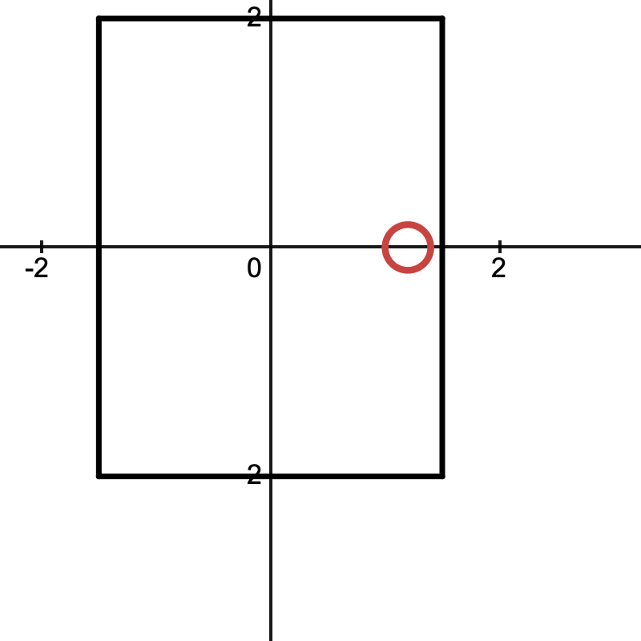

# Simulating heat in kitchen

## Problem description
*Describe, in words, the situation you would like to model*.

In a cooking environment with one window that heat can escape the room, the only heat source is from the stove fire. There is a chef that is cooking, we would like to know how the heat would effect the chef, and the temerature distribution within a room.

## Question formulation
*What question(s) would you like to answer about your setup above?*

- What size of window should it be (what the value of heat dissipation should reach) so that the chef can work in a sufferable temperature?
- What the temperature distribution in the cooking room when the temperature reach the steady state?
- Without the heat dissipation, how long will it take the room to reach the steady state?

## Mathematical model
*Identify variables, parameters, equations. List your assumptions. Identify the mathematical quantity you will evaluate, in order to answer your question.*

<!--*These steps should probably be done simultaneously, not in order -- as you refine your equations, you will need to update your assumptions, etc. Furthermore, you might want to start with the last point, how to answer your question, and work backwards to determine what variables/parameters you need to do this.*

*Note that **independent variables** are variables that vary no matter what -- usually time, sometimes space. **Dependent variables** are variables which are functions of the independent variables. Usually, you are trying to solve for these. **Parameters** are numbers associated with features of the model, whose values you may need to determine by searching in the literature or by further modelling, but they don't usually vary with the independent variables.*-->

**Assumptions:**

- The only way to make heat dissipation is the opened window.
    - The wall and doors or any substance in the room will not take away the heat.
- The stove is the only heat source, and can provide heat continuesly.
    - Simulating the countinuous cooking environment in a resturant.
- the wok is not effect the heat transfering from the stove.
- the dissipation rate will stay constant.

**Variables and parameters**

| Symbol | Meaning | Type / role | Dimension | Units |
|:---:|:---|:---:|:---:|:---:|
| $u(x,y,t)$ | Temperature at location $(x,y)$ and time $t$ | Dependent variable | - | K |
| $t$ | Time | Independent variable | T | s |
| $x$ | Horizontal position in room | Spatial coordinate | L | m |
| $y$ | Vertical position in room | Spatial coordinate | L | m |
| $z$ | Height of the kichen | Spatial coordinate | L | m|
| $r$ | Radius of the stove | Spatial coordinate | L | m |
| $\alpha$ | Thermal diffusivity of air | Diffusion coefficient (parameter) | $L^2/T$ | m^2/s |
| $\beta$ | Heat dissipation rate (volumetric loss) | Sink coefficient (parameter) | $1/T$ | s^-1 |
| $\gamma$ | Constant heater source rate (stove heat input) | Source coefficient (parameter) | $\theta/T$ | K/s |

**Domain:**

Since the room is not very high, we consider the room as 2D with domain:
$$
\Omega = [-1.5, 1.5]\times[-2, 2]
$$
- The heat is added to the room at $(1.2, 0)$ (the location of the stove). 
- The stove has a radius of $r$.

**Equations:**

We develop the governing equation needed with the ordinary heat equation 

$$
u_t = \alpha (u_{xx} + u_{yy})
$$

Since we need the heat to escape in a way, we introduce a new loss term, $-\beta u$, that describes heat dissipation (loss of heat) such that 

$$
u_t = \alpha (u_{xx} + u_{yy}) + S(x, y, t) - \beta u , 
$$
where we need $z\displaystyle\int S(x, y, t) dxdy = \gamma$. We can use model such as 
- $S(x, y, t) = C\cdot 1_{\sqrt{x^2 + y^2}<r}(x, y)$. Solve for C.
- $S(x, y, t) = \dfrac{\gamma/z}{\sqrt{2\pi \cdot 0.1}}e^{-\dfrac{(x^2 + y^2)}{2\cdot 0.1}}$. (A Gaussian with s.d. $0.1$.)

**Initial condition:**
- u(x, y, 0) = room temperature.

**Boundary conditions:**
- $u_x(-1.5, y, t) = u_x(1.5, y, t)$
- $u_y(x, -2, t) = u_y(x, 2, t)$

## How will you answer your question?
*Identify a mathematical quantity you will evaluate and criteria for evaluating it*

- We use numerical methods to simulate and see the results of the heat to the chef.
    - By changing the size of the window (i.e., changing $\beta$).
- Stability analysis to check the stability of the model.

