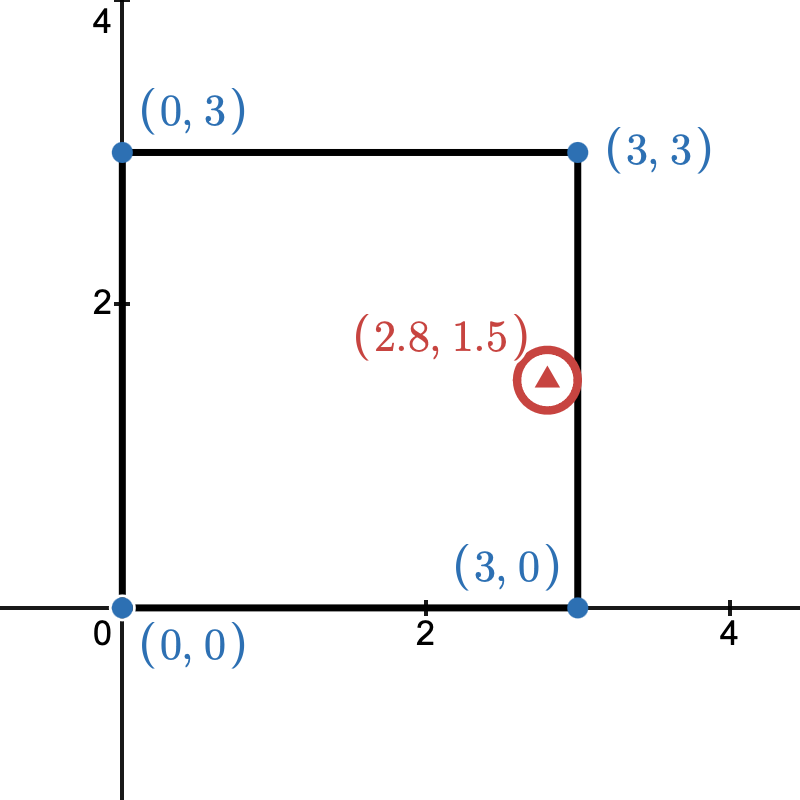

# Simulating heat in kitchen

## Problem description
<!--**Describe, in words, the situation you would like to model*.*-->

In a cooking environment where heat is removed by air conditioning, the heat source is the thermal radiation emitted by the stove and cookware, which diffuses through the kitchen air at chef level. Convective updrafts and range hood extraction are not modeled. We would like to know how the radiant heat affects the chef, and the temperature distribution within the room.

## Question formulation
<!--* *What question(s) would you like to answer about your setup above?* *-->

- What cooling power should the air conditioning provide (i.e. what value of $\beta$) so that the chef can work at a tolerable temperature?
- What is the temperature distribution in the cooking room when steady state is reached?
- Without air conditioning ($\beta = 0$), how long will it take the room to reach steady state?

## Mathematical model
<!--* *Identify variables, parameters, equations. List your assumptions. Identify the mathematical quantity you will evaluate, in order to answer your question.* *-->

<!--*These steps should probably be done simultaneously, not in order -- as you refine your equations, you will need to update your assumptions, etc. Furthermore, you might want to start with the last point, how to answer your question, and work backwards to determine what variables/parameters you need to do this.*

*Note that **independent variables** are variables that vary no matter what -- usually time, sometimes space. **Dependent variables** are variables which are functions of the independent variables. Usually, you are trying to solve for these. **Parameters** are numbers associated with features of the model, whose values you may need to determine by searching in the literature or by further modelling, but they don't usually vary with the independent variables.*-->

**Assumptions:**

- The only mechanism for heat removal is the air conditioning unit, which cools the room uniformly.
    - The walls, doors, and all other surfaces are perfectly insulated and do not absorb or remove heat.
- The stove and cookware are the only sources of thermal radiation, emitting heat continuously. This simulates a continuous cooking environment in a restaurant.
- Convective heat transfer (e.g. updrafts, range hood extraction) is not modeled. Only lateral radiant diffusion at chef level is considered.
- The dissipation rate will stay constant.
- The temperature is modeled only in the horizontal plane (bird's-eye view). Variation in temperature with height is ignored; the domain represents a depth-averaged slice at chef level.

**Variables and parameters**

| Symbol | Description | Type | Dimension | Units |
|:---:|:---|:---:|:---:|:---:|
| $u(x,y,t)$ | Temperature at location $(x,y)$ and time $t$ | Dependent variable | $\theta$ | K |
| $t$ | Time | Independent variable | T | h |
| $x$ | Horizontal position in room | Independent variable | L | m |
| $y$ | Vertical position in room | Independent variable | L | m |
| $z$ | Height of the kichen | parameter | L | m|
| $T_a$ | Room temerature. | parameter | $\theta$ | K |
| $\alpha$ | Thermal diffusivity of air |parameter | $L^2/T$ | m^2/h |
| $\beta$ | Heat dissipation rate due to air conditioning | parameter | $1/T$ | h^-1 |
| $\gamma$ | Effective radiant power emitted laterally by the stove and cookware into the surrounding air at chef level | parameter | $\theta L^3/T$ | K*m^3/h |

**Constraints:**
- $t\ge0$.
- $(x, y)\in \Omega$
- $z, r\ge0$
- $\alpha, \beta, \gamma > 0$

**Domain:**

Since the room is not very high, we consider the room as 2D with domain:

$$
\begin{aligned}
\Omega &= [0, 3]\times[0, 3] \\
&= \left\{ (x, y) \in\mathbb{R}^2 \mid 0 \le x \le 3 \land 0 \le y \le 3 \right\}
\end{aligned}
$$

- The heat is added to the room at $(2.8, 1.5)$ (the location of the stove). 
- The stove has a radius of $r$.

**Equations:**

We develop the governing equation needed with the ordinary heat equation 

$$
u_t = \alpha (u_{xx} + u_{yy})
$$

Since we need the heat to escape in a way, we introduce a new loss term, $-\beta u$, that describes heat dissipation (loss of heat) such that 

$$
u_t = \alpha (u_{xx} + u_{yy}) + S(x, y) + L(u), 
$$

where we need $z\displaystyle\int\int S(x, y) dxdy = \gamma$. We can use Gaussian model such as 

$$
S(x, y) = \frac{\gamma/z}{2\pi \cdot \sigma^2}\exp\left(-\frac{(x - 2.8)^2 + (y - 1.5)^2}{2\cdot \sigma^2}\right) ,
$$

where $\sigma$ is the standard deviation. For instance, we can set $\sigma = 0.1$.

Next, for heat loss, we can consider $\beta u$ as our sink term, so that the heat is taken away by central air conditioning. On the other hand we can also take $L$ as a function that simulates the heat taken away by a central air conditioning. To make it to a function of $x, y, t$, we can use the Newton's heat law, 

$$
\frac{dT}{dt} = -\beta(T-T_a)
$$

where $T_a$ is the ambient temperature, to make this equation in the form of our variable, we make $u$ represent the $T$ in the formula, and make the $T_a$ have the value of the room temperature, hence:

$$
u_t = -\beta(u-T_a)
$$

which is the heat loss, i.e., the $L$, hence,

$$
L (u) = - \beta (u - T_a)
$$

**Initial condition:**
- $u(x, y, 0)$ = room temperature.

**Boundary conditions:**
The walls are perfectly insulated (zero heat flux). Heat removal by air conditioning is modeled via the sink term L(u) uniformly across the domain, rather than through the boundary conditions.

- $u_x(0, y, t) = u_x(3, y, t) = 0$
- $u_y(x, 0, t) = u_y(x, 3, t) = 0$

## How will you answer your question?
<!--* *Identify a mathematical quantity you will evaluate and criteria for evaluating it* *-->

- We use numerical methods to simulate and see the results of the heat to the chef.
    - By changing the cooling power of the air conditioning (i.e. changing $\beta$ where larger $\beta$ represents a stronger AC unit).
- Stability analysis to check the stability of the model.
- How long will the heat reach a certain threshold if not heat escape.
